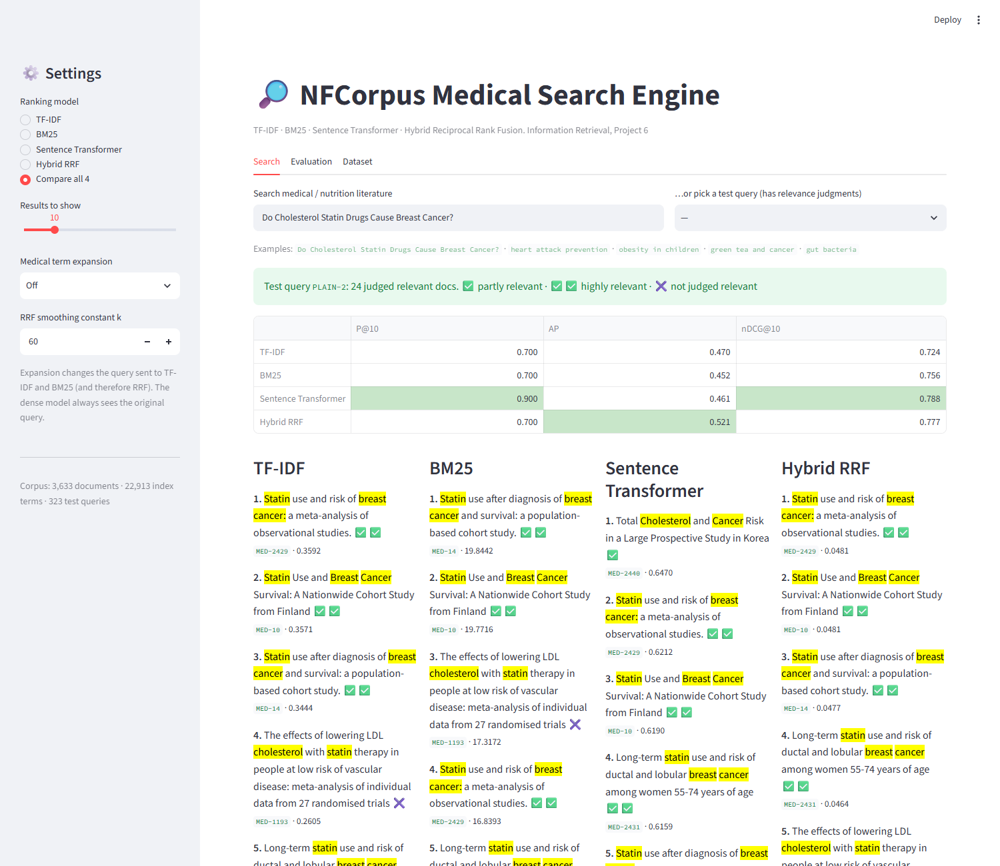
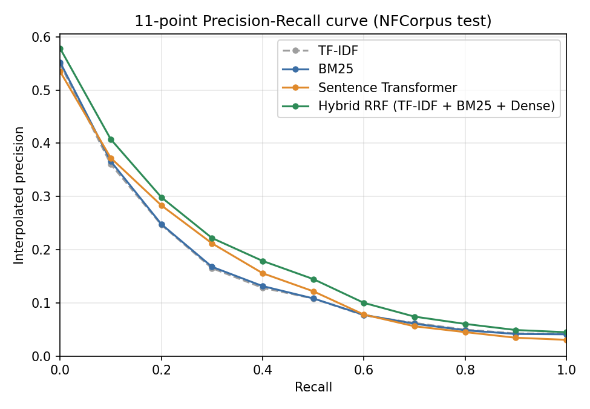
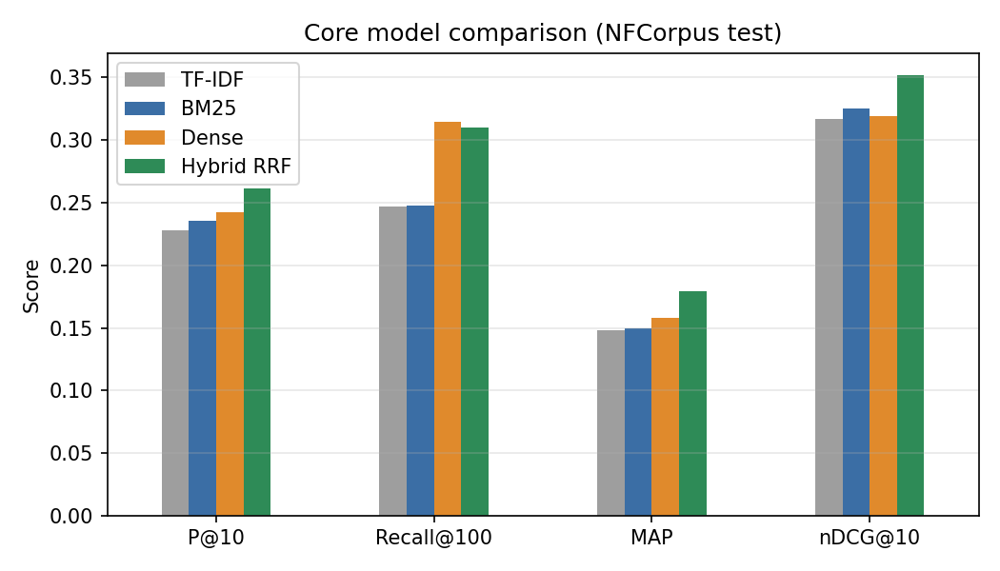

# NFCorpus Medical Search Engine

**Information Retrieval, Project 6: Medical Search using NFCorpus**

This search engine covers medical and nutrition literature. It compares four ranking approaches on the [NFCorpus](https://www.cl.uni-heidelberg.de/statnlpgroup/nfcorpus/) benchmark (BEIR version):

- **TF-IDF**, a classical vector space model
- **BM25**, a probabilistic sparse retrieval model
- **Sentence Transformer**, dense semantic retrieval with `all-MiniLM-L6-v2`
- **Hybrid RRF**, which merges the three rankings with Reciprocal Rank Fusion

It also adds **medical term expansion**, using pseudo-relevance feedback and embedding neighbours. The project comes with an interactive Streamlit search interface.



## Results (323 test queries)

| Model | P@10 | Recall@100 | MAP | nDCG@10 |
|---|---|---|---|---|
| TF-IDF | 0.2282 | 0.2470 | 0.1479 | 0.3167 |
| BM25 | 0.2356 | 0.2476 | 0.1495 | 0.3253 |
| Sentence Transformer | 0.2427 | **0.3149** | 0.1578 | 0.3190 |
| **Hybrid RRF** (TF-IDF + BM25 + Dense) | **0.2610** | 0.3100 | **0.1791** | **0.3517** |
| *Extension:* BM25 + PRF expansion | 0.2635 | 0.3268 | 0.1826 | 0.3468 |
| *Extension:* Hybrid RRF with PRF-expanded BM25 | **0.2666** | **0.3525** | **0.1941** | **0.3606** |

Full tables are in [`results/metrics.md`](results/metrics.md), and the per-query analysis is in [`results/analysis.md`](results/analysis.md).

- BM25 and the dense model each win on exactly **108** of the 323 queries. The two approaches are strong on *different* queries.
- That is why RRF helps. It beats the best single model's nDCG@10 by **+8%**, beats *both* BM25 and Dense on 52 queries, and is worse than both on only 9.
- BM25 wins on rare exact terms such as *kohlrabi*, *cadaverine* and *rickets*. Dense wins on paraphrased, title-like queries such as *"Vitamin D: Shedding some light on the new recommendations"*.
- PRF expansion improves BM25 (nDCG@10 goes from 0.325 to 0.347). Combining it with RRF gives the best system overall.
- As a sanity check, our BM25 nDCG@10 of 0.325 matches the published BEIR BM25 baseline for NFCorpus.

<p>


</p>

## Setup

Requires Python 3.10+.

```bash
pip install -r requirements.txt
python -c "import nltk; nltk.download('stopwords')"
```

The dataset (~3 MB) and the `all-MiniLM-L6-v2` model download automatically on first run.

## Run

```bash
python run_eval.py      # evaluate all models -> results/ (first run ~3-4 min: embeds the corpus)
python analyze.py       # per-query analysis -> results/analysis.md
streamlit run app.py    # interactive search interface at http://localhost:8501
```

Each module can also be run on its own for a quick demo, e.g. `python -m src.preprocess` (preprocessing example), `python -m src.index` (index stats), `python -m src.rankers` (one query through all 4 models) and `python -m src.expansion` (expansion examples).

### Search interface
- **Search tab:**
  - Choose one model, or **Compare all 4** side by side.
  - Query terms are highlighted in yellow and expansion terms in blue.
  - For the 323 test queries, each result is marked relevant (✅, or ✅✅ for highly relevant) or not (✖️), and the per-query P@10, AP and nDCG@10 are shown.
- **Evaluation tab:** the full metrics tables, Precision-Recall curves and the RRF *k* sweep.
- **Dataset tab:** corpus statistics, charts, and an inverted-index lookup.
- URLs can carry a search, e.g. `http://localhost:8501/?q=heart%20attack%20prevention&mode=compare&exp=prf`. `mode` is one of tfidf, bm25, dense, rrf or compare; `exp` is one of prf or emb.

## How it works

```
query ─► preprocess ─┬─► TF-IDF  (inverted index) ──┐
  (clean, tokenize,  ├─► BM25    (inverted index) ──┼─► RRF: Σ 1/(60 + rank) ─► results
   stopwords, stem)  │     ▲ optional PRF / embedding expansion
                     └─► raw text ─► MiniLM ─► cosine vs cached doc embeddings ─┘
```

| File | What it does |
|---|---|
| `src/data.py` | Loads NFCorpus (`beir/nfcorpus/test`) via `ir_datasets` and caches it in `data/` |
| `src/preprocess.py` | Lowercases, cleans and tokenizes text (keeping terms like `omega-3` and `b12`; hyphenated compounds are also split into their parts), removes NLTK stopwords and applies the Porter stemmer |
| `src/index.py` | Hand-built inverted index: `term → {doc: tf}`, document frequencies, document lengths |
| `src/rankers.py` | TF-IDF (log-tf × idf, cosine), BM25 (k1=1.2, b=0.75), dense MiniLM retrieval, and `rrf_fuse` |
| `src/expansion.py` | Pseudo-relevance feedback (RM3-style, top 10 docs → 10 terms, weight 0.5) and embedding-neighbour expansion that checks each candidate against the whole query |
| `src/evaluate.py` | P@10, Recall@100, AP/MAP, graded nDCG@10 and the 11-point interpolated P-R curve |
| `run_eval.py` | Runs every model on all test queries and writes the tables and graphs to `results/` |
| `analyze.py` | Per-query win/loss analysis |
| `app.py` | Streamlit interface |

TF-IDF and BM25 are written from scratch on top of our own inverted index; no IR library is used for ranking. The dense model gets raw, unstemmed text, because transformers are trained on natural language.

## Repository layout

```
src/             core IR code
results/         metrics tables, P-R curves, dataset charts, per-query analysis
report/          report draft, screenshots, demo script
resources/       assignment brief, report template, project plan
data/            dataset + index + embedding caches (generated, not committed)
```

## References
- Boteva, V., Gholipour, D., Sokolov, A., Riezler, S. *A Full-Text Learning to Rank Dataset for Medical Information Retrieval.* ECIR 2016.
- Thakur, N., et al. *BEIR: A Heterogeneous Benchmark for Zero-shot Evaluation of Information Retrieval Models.* NeurIPS Datasets & Benchmarks 2021.
- Robertson, S., Zaragoza, H. *The Probabilistic Relevance Framework: BM25 and Beyond.* 2009.
- Reimers, N., Gurevych, I. *Sentence-BERT.* EMNLP 2019.
- Cormack, G. V., Clarke, C. L. A., Büttcher, S. *Reciprocal Rank Fusion outperforms Condorcet and Individual Rank Learning Methods.* SIGIR 2009.
- Lavrenko, V., Croft, W. B. *Relevance-Based Language Models.* SIGIR 2001.
